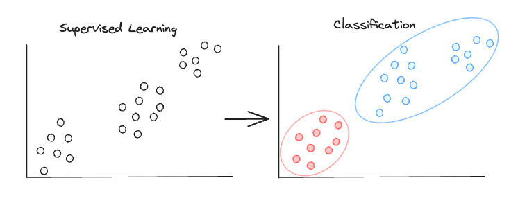
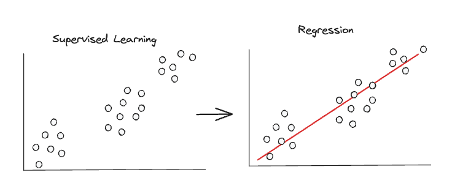
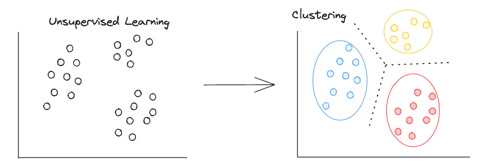

# Machine Learning Concepts

## Supervised Learning 
Supervised learning involves training a machine learning model on a labeled dataset. This means that each training example is associated with an output label. The model learns to predict the output from the input data during the training process. Once the model is trained, it can be used to predict outcomes for unseen data. The input data are the features and the output the label. Supervised Learning is usually divided into two main categories i.e. regression and classification

### Classification

The aim of classification is to categorize or classify data points into predefined classes or categories. The objective of classification is to accurately predict the labels (dependent variables) of new data based on the known labels of historical data and the features (independent variables) of the model.

A classification example is to determine whether an email is 'spam' or 'not spam' based on features such as the email content, frequency of certain words, sender's information, etc.

Common models used in classification include K-Nearest Neighbors, Random Forest, Logistic Regression, Support Vector Machinesß, and Neural Networks. These models serve as the foundation for understanding and applying classification algorithms in machine learning tasks.

### Regression

The aim of regression is to predict a continuous output (dependent variable) based on the independent variables (the features) of your model. An example of regression is to predict the property prices based on features suach as location, size, age, etc.
Models like linear regression, Polynomial Regression, Logistic Regression are the entry point of regression algorithms.

## Unsupervised Learning

Unsupervised learning involves training a model on unlabeled data. The model tries to learn the patterns and the structure from the data without any indication on what to predict. Unsupervised learning is used to predict an output from datasets consisting of input data without labeled responses.

## Clustering

The main goal of clustering is to discover and partition data into groups or clusters in a way that data points within a group are closer to each other, or more similar to each other than data points in other groups. Groups are based on distance, density, or other types of measures.

A clustering example could be Social Network Analysis, where you try to detect communities withint your social network based on how members are realated to each other. Another example could be clustering cells based on their gene expression.

Common models are K-Means Clustering, Hierachical Clustering and DBSCAN. The main challenge with these algorithms is to find the optimal number of clusters.