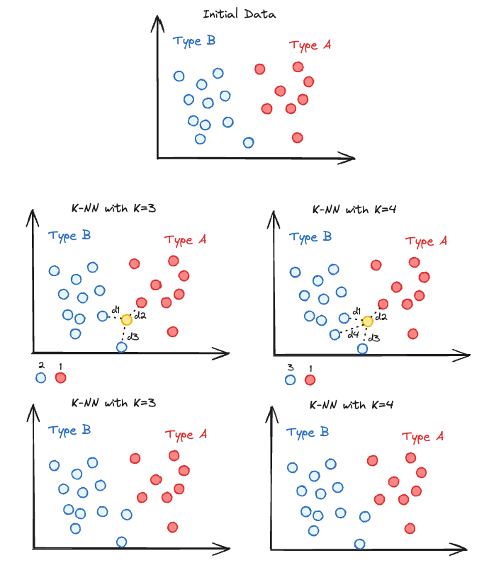
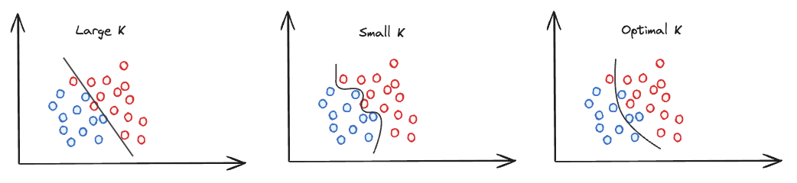

# K-Nearest Neighbors (KNN)

K-Nearest Neighbors (KNN) is a simple, yet powerful machine learning algorithm used for both classification and regression tasks. It operates on the principle that similar data points are likely to be in close proximity to each other. KNN makes predictions about the classification of a sample based on the majority class among its nearest neighbors.

## Understanding KNN

The core idea behind KNN is to look at the 'k' closest labeled data points and predict the label of a new point based on these neighbors. The number 'k' is a hyperparameter that the user must define. The choice of 'k' affects the performance and accuracy of the algorithm.

## KNN Algorithm

1. **Choose the Number 'k' of Neighbors**: Decide on the value of 'k', which is the number of nearest neighbors to consider for making the prediction. It is not always easy to determine the optimal amout of neighbors to consider, since there is not a mathematical way to determine it. One needs to try different values a compare how the models behaves based on 'k'. 
2. **Calculate the Distance**: For a new data point, calculate the distance between this point and all other points in the dataset. Common distance metrics include Euclidean, Manhattan, and Minkowski.
3. **Find the Nearest Neighbors**: Identify the 'k' closest data points (neighbors) based on the distance metric.
4. **Vote for Labels**:
    - In classification tasks, the predicted label is the most common label among the 'k' nearest neighbors.
    - In regression tasks, the prediction is typically the average value.

In the example above, we have a yellow point that we want to classify. On the left side, since k=3, we will check the type of the three closest neighbours and then attribute the yellow point a class (type in the drawing). Since there are two points of type B and one of type A. The yellow point is being classified as Type B. The same logic is showed when k=4 on the right side of the drawing.

## Hyperparameter Tuning in KNN

- **Number of Neighbors ('k')**: The most critical hyperparameter to tune. The optimal 'k' depends on the data; too small 'k' can lead to overfitting, while too large 'k' may cause underfitting.

- **Distance Metric**: Choosing the right distance metric like the Euclidean distance or the Manhattan distance can  impact the performance of your model.
- **Weights**: It is also possible to weigh the votes of the neighbors based on their distance. Closer neighbors can have a more significant influence on the prediction.

## Considerations

When implementing KNN, especially with large datasets, consider the following:

- **Feature Scaling**: KNN is distance-based, so all features should be on the same scale for the algorithm to work correctly.
- **Curse of Dimensionality**: KNN may perform poorly with high-dimensional data due to the increasing sparsity of data points. Dimensionality reduction techniques can be beneficial.

## Conclusion

K-Nearest Neighbors is an easy algorithm that requires no model training in the traditional sense, making it straightforward to implement and understand. Its performance relies on the choice of 'k', the distance metric, and the data's nature. Even if KNN is simple, it can perform greatly in nonlinear data as well as when the decision boundary are irregular, or non continuous.
