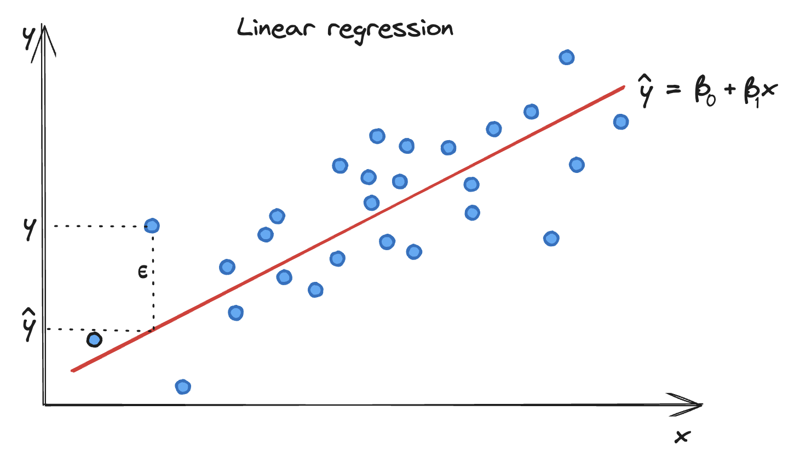

## Linear Regression

Linear regression is a method used to model the relationship between a dependent variable and one or more independent variables by fitting a linear equation to observed data. The simplest form of linear regression is a straight line fitting, known as simple linear regression, This happens when you try to explain the dependent variable with one independent variable. An example would be to predict the hight of a person based on the age of the person. When there are multiple independent variable example age and weight to predict the age, the method is called multiple linear regression.

### Linear Regression Mathematical Formulation

The equation of a simple linear regression line is given by:

$$ y = \beta_0 + \beta_1x + \epsilon $$

where:
- $y$ is the dependent variable (target),
- $x$ is the independent variable (predictor),
- $\beta_0$  is the y-intercept of the regression line,
- $\beta_1$ is the slope of the regression line, which represents the change in \(y\) for a one-unit change in \(x\),
- $\epsilon$ represents the error term, accounting for the variability in \(y\) that cannot be explained by the linear relationship with \(x\).

However, our prediction formula will be:

$$\hat{y} = \beta_0 + \beta_1 \cdot x $$

with 
$$\epsilon = y - \hat{y}$$

### Fitting the Model: Least Squares Method

The parameters $\beta_0$ and $\beta_1$ are estimated during the training process using the method of least squares. The objective is to find the best-fitting line through the data points that minimizes the sum of the mean squared differences between the observed values and the values predicted by the linear model.

$$ MSE =\frac{1}{n} \sum_{i=1}^{n} (y_i - \hat{y}_i)^2 $$

The method of the **Gradient Descent** is used to find the optimal $\beta_0$ and $\beta_1$ over a couple of iterations.

The partial derivative of the MSE with respect to $\beta_0$ is:
$$
\beta_0 = \beta_0 - \alpha \cdot \frac{\partial MSE}{\partial \beta_0}
$$
with
$$
\frac{\partial MSE}{\partial \beta_0} = -\frac{2}{N} \sum_{i=1}^{N} (y_i - (\beta_0 + \beta_1 x_i))
$$

The partial derivative of the MSE with respect to $\beta_1$ is:
$$
\beta_1 = \beta_1 - \alpha \cdot \frac{\partial MSE}{\partial \beta_1})
$$
with
$$
\frac{\partial MSE}{\partial \beta_1} = -\frac{2}{N} \sum_{i=1}^{N} (y_i - (\beta_0 + \beta_1 x_i)) x_i
$$

$\alpha$ is an hyperparameter that controls how much we are adjusting the parameters of our model with respect to the gradient of the loss function. Essentially, it determines the size of the steps we take on the path to the minimum. 

 - If $\alpha$ is too small then the gradient descent can be slow to converge and take a very long time to find the minimum. 

- If $\alpha$ is too large then the gradient descent can miss the minimum which might cause the algorithm to diverge and never find the stop condition.
-  It is important to chose a good value of $\alpha$ to assure convergence, stability, and efficiency. 

### Error Metrics

To evaluate the fit of a linear regression model, several error metrics can be used, including:

- **Mean Squared Error (MSE)**: The average of the squares of the errors between the observed and predicted values. It's calculated as \(MSE = $\frac{1}{n}$ $\sum_{i=1}^{n}$ $(y_i - \hat{y}_i)^2$.

- **Root Mean Squared Error (RMSE)**: The square root of MSE, providing error in the same units as the dependent variable. It's more sensitive to large errors than MSE.

- **R-squared (\(R^2\))**: A statistical measure of how close the data are to the fitted regression line. It's the proportion of the variance in the dependent variable that is predictable from the independent variable(s), ranging from 0 to 1, where 1 indicates perfect prediction.

### Conclusion

Linear regression is a foundational technique in statistics and machine learning, used for predicting outcomes and understanding relationships between variables.
