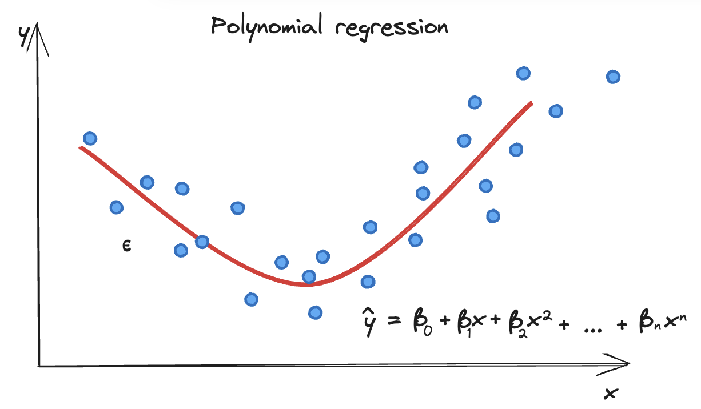
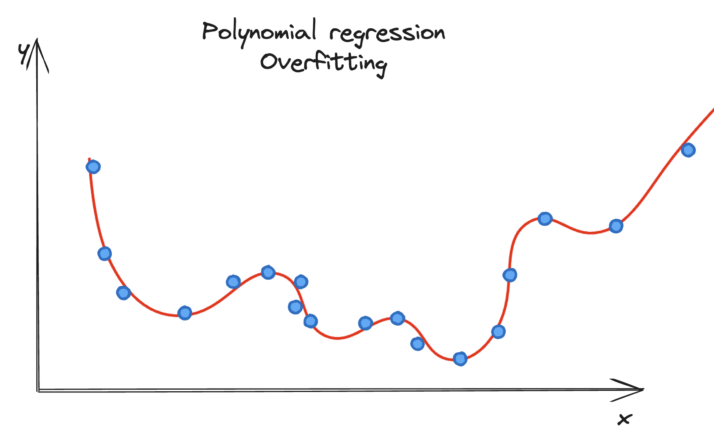

# Polynomial Regression

Polynomial regression is a type of regression analysis in which the relationship between the independent variable $x$ and the dependent variable $y$ is modeled as an $n$th degree polynomial. Unlike linear regression, which models a straight-line relationship, polynomial regression can fit data with curves, making it more flexible for capturing complex relationships. By adjusting the degree.

 

## Mathematical Formulation

The general form of a polynomial regression equation is:

$$
y = \beta_0 + \beta_1x + \beta_2x^2 + \cdots + \beta_nx^n + \epsilon
$$

- $y$ is the dependent variable.
-  $x$ is the independent variable.
- $\beta_0$, $\beta_1$, $\beta_2$, $\ldots$, $\beta_n$ are the regression coefficients representing the intercept and the slope of the regression line respectively.
- $n$ is the degree of the polynomial.
- $\epsilon$ is the error term, the part of $y$ the regression model cannot explain.

### Fitting the Model

Polynomial regression models are usually fitted using the least squares method. This involves minimizing the sum of the squares of the differences between the observed and predicted values of the dependent variable.

$$ MSE =\frac{1}{n} \sum_{i=1}^{n} (y_i - \hat{y}_i)^2 $$

The gardient descent used to minimize the MSE in given by:
$$
\beta_j = \beta_j - \alpha \cdot \frac{\partial MSE}{\partial \beta_j}
$$
with:
- α is the learning rate.
- $\frac{\partial MSE}{\partial \beta_j}$ is the partial derivative of the MSE with respect to coefficient $\beta_j$

### Overfitting and Model Selection

One of the main issues with polynomial regression is the potential for overfitting if the degree of the polynomial is too high. Overfitting occurs when the model becomes too complex and captures the noise in the data, leading to poor predictive performance on new data. It is crucial to choose the degree of the polynomial carefully, often through cross-validation techniques, to ensure the model generalizes well to unseen data.

## Conclusion

Polynomial regression provides a way to model a wider range of relationships between variables, including those that exhibit curvature. Careful model selection and validation are crucial to prevent overfitting and ensure the model's predictive performance.
