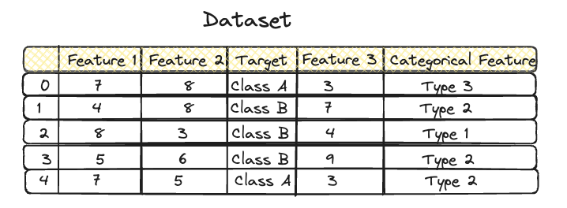
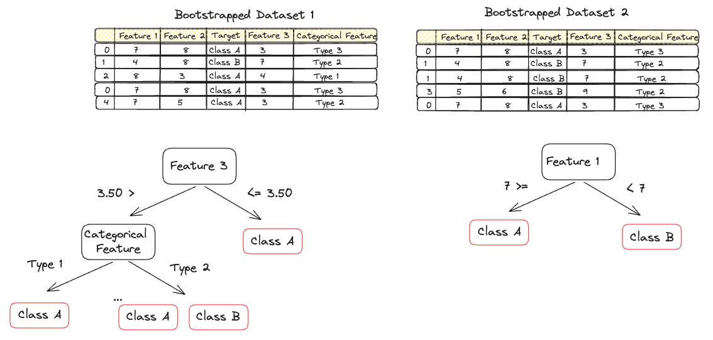

# Random Forest
Random Forest is an ensemble learning method for classification, regression, and other tasks that operates by constructing a multitude of decision trees at training time. For regression tasks, the output of the Random Forest is the average prediction of the trees. It is known that single decision trees tend to overfit the training data. To overcome the limitations of individual decision trees, Random Forests combine multiple trees to improve flexibility and accuracy. This enhancement is achieved by creating a diverse set of decision trees and then aggregating their predictions, which leads to better generalization on unseen data.

## Creating a Random Forest
Step 1: Create a Bootstrap Dataset
A bootstrap dataset is generated by randomly selecting samples from the original dataset, with replacement meaning that there can be repetition, until the bootstrap dataset matches the size of the original. This process introduces variability among the trees.

Step 2: Create a Decision Tree Using the Bootstrap Dataset
For each tree, a random subset of variables (or features) is considered at each decision point. This randomness increases the diversity among the trees, helping to ensure that they capture different aspects of the data.
In the example below, we can see two bootstrapped datasets as well as the trees issues from these datasets.

## Repetition for Diversity
The processes of creating bootstrap datasets and constructing trees using subsets of variables are repeated multiple times, creating a forest of diverse trees. In our example we have only two trees, but normaly the algorithm will create hundred of them.

## Making Predictions
To make a prediction, new data is passed through all the trees in the forest. Each tree provides a vote (e.g., Class A or Class B in our example), and the final prediction is determined by the majority vote among all trees. This collective decision-making process enhances the model's accuracy and reliability. Now if the output wouldn't be categorical as it is in our example i.e Class A and Classe B, but rather a regression, then the final output would be the average of the outpus of the trees.

## Creating your Model

When using the Random Forest algorithm, one can tune the following hyperparameters:

* **Number of Trees**: The number of trees in the forest. A higher number of trees can improve the model's stability and accuracy but also increases computational cost.

* **Maximum Depth of Trees**: The maximum depth of each tree. Limiting the depth can prevent overfitting but setting it too low might lead to underfitting.

* **Minimum Samples Split**: The minimum number of samples required to split an internal node. Higher values prevent creating nodes that represent too specific case scenarios, thus avoiding overfitting.

* **Minimum Samples Leaf**: The minimum number of samples required to be at a leaf node. Setting this parameter can ensure that the model captures sufficient information from the data before making a prediction, reducing overfitting.

* **Maximum Features**: The number of features to consider when looking for the best split. This parameter controls the diversity among the trees in the forest, affecting the model's bias and variance.

* **Criterion**: The function to measure the quality of a split. For classification, common criteria are "gini" for Gini impurity and "entropy" for information gain. For regression, "mse" (mean squared error) and "mae" (mean absolute error) are common.

* **Maximum Leaf Nodes**: The maximum number of leaf nodes a tree can have. This can control the shape and complexity of the trees.

* **Minimum Impurity Decrease**: A node will be split if this split induces a decrease of the impurity greater than or equal to this value.

* **Class Weight**: This parameter is used to weigh the classes if the classes are imbalanced. It can significantly affect the decision boundary by prioritizing the minority class.

Tuning these hyperparameters typically involves trial and error or systematic approaches like grid search, random search, or more sophisticated methods.

## Conclusion
Random Forest is a powerful and versatile machine learning method capable of performing both regression and classification tasks. It effectively addresses the shortcomings of single decision trees by leveraging the strength of multiple trees, thus achieving high predictive performance while avoiding overfitting.

